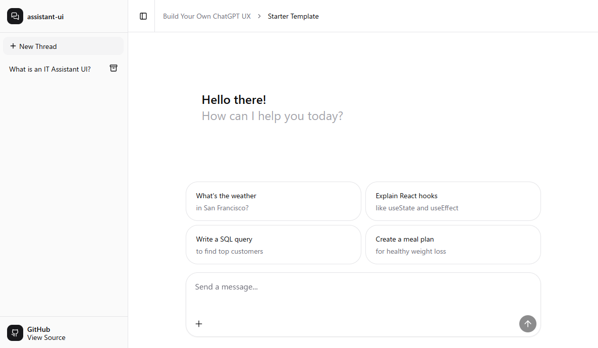

# assistant-ui + Azure OpenAI + Cosmos DB

This project is based on the [assistant-ui starter](https://github.com/Yonom/assistant-ui), created using:

```bash
npx assistant-ui@latest create
```

It extends the starter by adding:

- Chat threads/messages are persisted to Azure Cosmos DB (`threads`, `messages` containers).
- Azure OpenAI is used for chat responses and auto-title generation.

<div style="background-color: #eee; display: inline-block; padding: 8px;">
   
</div>

## TODO

- [ ] Use UUIDv4 for thread IDs when persisting
- [ ] Use UUIDv4 for message IDs when persisting
- [ ] Fix thread deletion errors (deleting a thread currently triggers an exception).

> [!CAUTION]
> Thread IDs are currently stored in a format like `__LOCALID_3yHFd1l`, and message IDs are stored in a format like `f0GjiXG`.

## Prerequisites

- Node.js 18+ (or the version specified in `.nvmrc` if present).
- Azure subscription with:
  - **Azure OpenAI** resource and a `gpt-4o` deployment
    - You’ll need the *deployment name* and *API key*.
  - **Azure Cosmos DB for NoSQL** account with:
    - A database (default: `assistant-ui-db`)
    - Containers:
      - `threads` (partition key: `/id`)
      - `messages` (partition key: `/id`)

## Setup

1. Copy environment file:
   - `cp .env.example .env.local` (or `.env`)
2. Set environment variables:
   - `HTTPS_PROXY`: URL of the proxy server for outbound HTTPS requests. (option)
   - `AZURE_RESOURCE_NAME`: Azure OpenAI resource name (used to build the endpoint).
   - `AZURE_API_KEY`: Azure OpenAI API key.
   - `AZURE_OPENAI_DEPLOYMENT_NAME`: Deployment name for the model.
   - `AZURE_COSMOS_DB_ENDPOINT`: Cosmos DB endpoint URL.
   - `AZURE_COSMOS_DB_KEY`: Cosmos DB key.
   - `AZURE_COSMOS_DB_NAME`: Cosmos DB database name (defaults to `assistant-ui-db`).
3. Install dependencies: `pnpm install`
4. Run locally: `pnpm dev` and open http://localhost:3000

## Notes

- Threads/messages are stored in Cosmos DB; ensure the containers exist before running.
